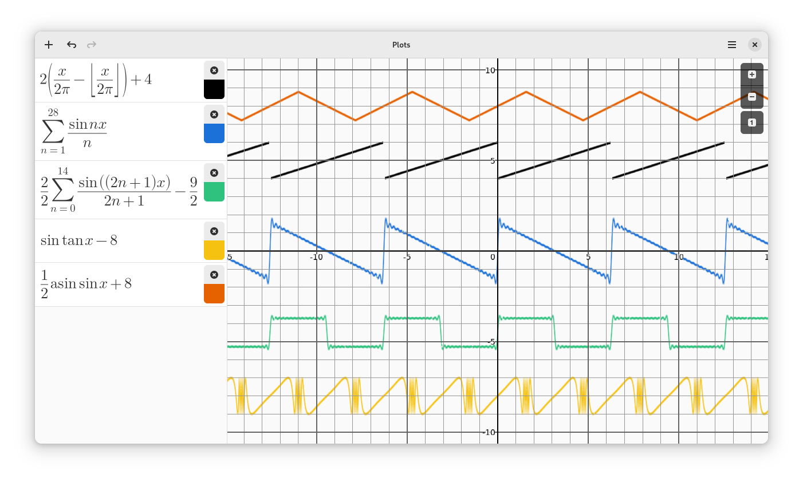
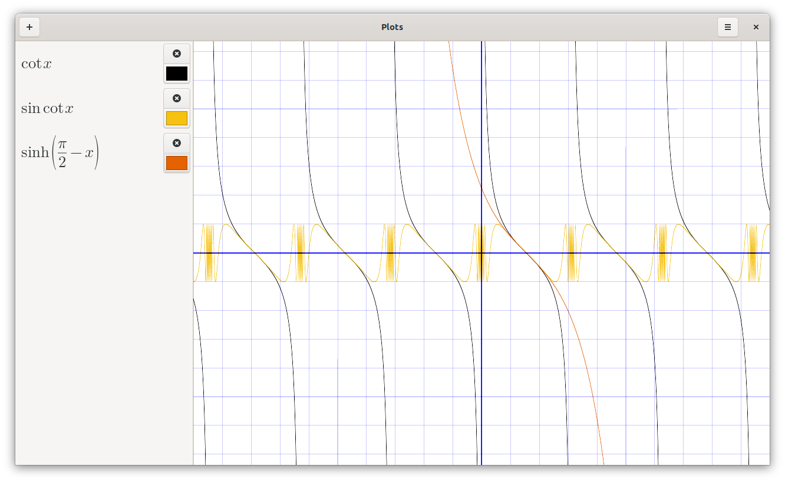
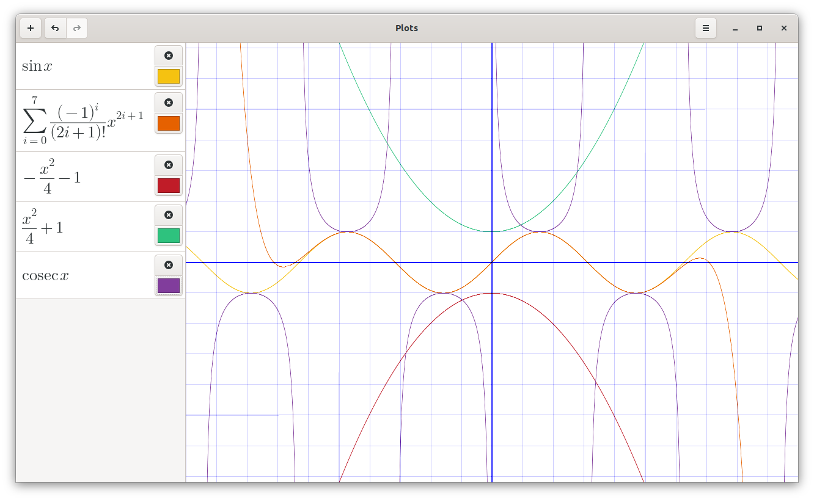

# Plots 
Plots is a graph plotting app for GNOME. Plots makes it easy to visualise
mathematical formulae. In addition to basic arithmetic operations, it supports
trigonometric, hyperbolic, exponential and logarithmic functions, as well as
arbitrary sums and products.

Plots is designed to integrate well with the GNOME desktop and takes advantage
of modern hardware using OpenGL.

