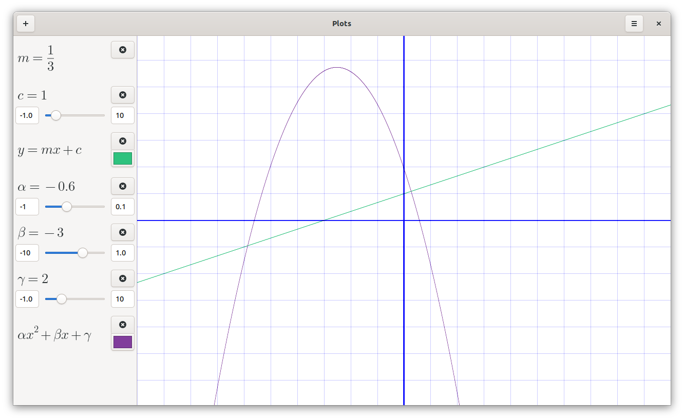

# Plots  [](https://hosted.weblate.org/engage/plots/)


Plots is a graph plotting app for GNOME. Plots makes it easy to visualise
mathematical formulae. In addition to basic arithmetic operations, it supports
trigonometric, hyperbolic, exponential and logarithmic functions, as well as
arbitrary sums and products. It can display polar equations, and both implicit
and explicit Cartesian equations.

Plots is designed to integrate well with the GNOME desktop and takes advantage
of modern hardware using OpenGL, and currently supports OpenGL 3.3+.

<a href='https://flathub.org/apps/details/com.github.alexhuntley.Plots'></a>

## Other Methods of Installation
> We are looking for volunteers to help us make native packages of Plots for Fedora, Arch and other major distributions. It would be great if you could help either by packaging, or by getting the following into the official repositories.

| Distribution | Package | Maintainer |
|:-:|:-:|:-:|
| Ubuntu | [PPA](https://launchpad.net/~apandada1/+archive/ubuntu/plots) | [Archisman Panigrahi](https://github.com/apandada1) |
| Debian | [.deb installer](https://launchpad.net/~apandada1/+archive/ubuntu/plots/+packages) | [Archisman Panigrahi](https://github.com/apandada1) |
| Arch | [AUR](https://aur.archlinux.org/packages/plots/)/[AUR(git)](https://aur.archlinux.org/packages/plots-git/) | [Mubashshir](https://github.com/ahmubashshir) |
| [GNU Guix](https://guix.gnu.org) | `guix install gnome-plots` | Guix Community |


Scroll down and click on a package name to download the .deb file from the PPA to use it in Debian.

You can also install with Python. Open a terminal in the repository and run

```bash
# python3 setup.py install
```
Note that this method does not currently install the icon, font or .desktop files. You can then run Plots using the `plots` command.

## Screenshots




## Development
Pull requests are welcome! The following sections detail how to run or build the project. The dependencies are in the [setup file](setup.py) and also the [Flatpak requirements file](flatpak-requirements.txt).

### Running from source
To run directly without installation, open a terminal in the root of the repository and run
```bash
$ python3 -m plots
```
### Building the Flatpak
To generate the manifest for the python modules, download [flatpak-pip-generator](https://github.com/flatpak/flatpak-builder-tools/tree/master/pip) and run
```bash
$ python3 flatpak-pip-generator --requirements-file=flatpak-requirements.txt --no-build-isolation
```
It is only necessary to do this when `flatpak-requirements.txt` changes.

Then build and install the Flatpak using
```bash
$ flatpak-builder --user --install build --force-clean com.github.alexhuntley.Plots.json
```
### Translations
Would you like to see Plots in your own language? We welcome translators' contributions to Plots.

We recommend you use [Weblate](https://hosted.weblate.org/engage/plots/).

When translating help files using Weblate, you have to create a new translation for each file. Do not forget `index.page`, as it is mandatory for the help files to work.

The `.desktop` file can be translated [here](/res/com.github.alexhuntley.Plots.desktop).

The AppStream metainfo file (containing the title, summary and description used in GNOME Software, the [Flathub Store](https://flathub.org/apps/details/com.github.alexhuntley.Plots), [Apps for GNOME](https://apps.gnome.org/en/app/com.github.alexhuntley.Plots/) etc.) can be translated [here](res/com.github.alexhuntley.Plots.metainfo.xml).
